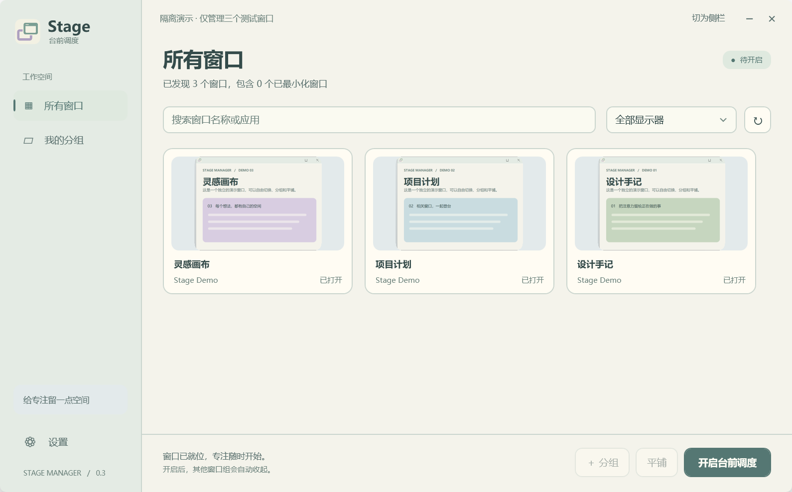
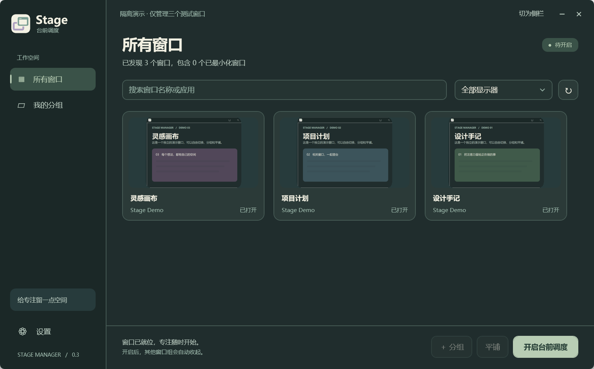
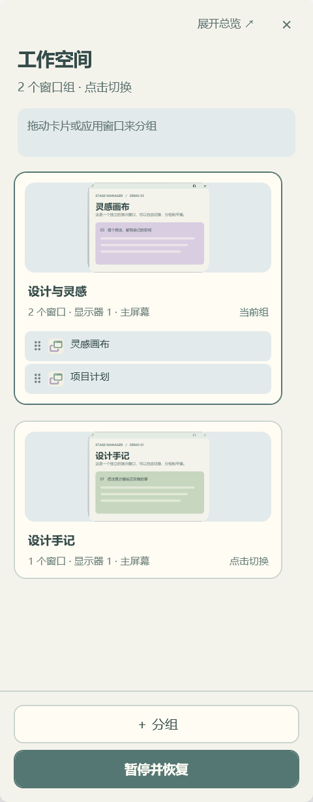
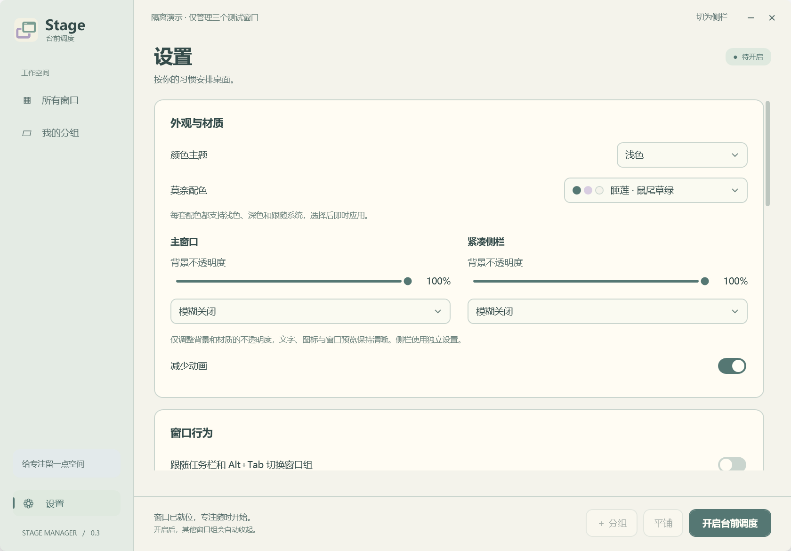

  
  <h1>Stage Manager for Windows</h1>
  
台前调度 · 给专注留一点空间

  
将相关窗口放在一起，在总览与侧栏间轻松切换。

  
  

  
<a href="https://github.com/Ranshen1209/stage-manager/releases/latest">下载最新版</a> · <a href="docs/guide.zh-CN.md">使用手册</a> · <a href="https://github.com/Ranshen1209/stage-manager/issues">反馈问题</a>

---

一个受 macOS 台前调度启发的独立 Windows 桌面应用。使用 C#、WPF 与 Windows 原生窗口接口构建，便携运行，无遥测，无第三方运行依赖。与 Apple 无关联。

## 界面预览

以下为隔离演示中的真实应用界面，仅包含自建示例窗口。所有截图均使用 **100% 背景不透明度、关闭模糊**。

**浅色总览 · 睡莲**

**深色总览 · 睡莲**

| 侧栏分组 | 外观设置 |
| --- | --- |
|  |  |

## 能做什么

- **按应用归组**：同一应用新开的窗口自动加入已有组，也支持手动组合不同应用。
- **拖动整理与排序**：拖动时显示跟随鼠标的浮层和插入线；支持组内成员排序、整个分组排序、合并与拆组，侧栏支持边缘滚动。点击成员可将对应窗口置顶。
- **保留所选窗口**：从任务栏或 Alt+Tab 切换到组内成员时，保留它的焦点与前台层级。
- **可调侧栏**：最窄支持 180 个逻辑像素，拉宽自动排列为 2 列、3 列或更多列，记住位置与大小；贴边后可自动收起，鼠标移到屏幕边缘或拖动受管理窗口时平滑展开。
- **应用白名单**：临时找文件、回消息时保留当前工作组。支持从已打开的窗口或 EXE 添加，规则跨重启保存。
- **多屏与虚拟桌面**：每块显示器独立切组，各 Windows 桌面保留各自分组，支持每屏 DPI 缩放。
- **远程切屏与等比布局**：屏幕稳定后，按可用工作区比例同步缩放受管理窗口的大小和位置；长宽比不同则整体居中留白。支持分辨率 / 缩放动态调整、手动修改新基准及反复往返，保留分组。
- **莫奈主题**：六套配色，浅色、深色与跟随系统；总览和侧栏可分别调整背景不透明度与模糊。
- **托盘与快捷键**：直接按键录入全局快捷键，自动检测冲突；可选关闭后后台运行、自启和静默启动。
- **中键切换桌面**：可选按住中键左右移动，切换 Windows 虚拟桌面。默认关闭，支持反转方向和调整触发距离。
- **记住布局**：重启本应用后恢复仍然打开的窗口分组、位置与最近成员；退出时恢复接管前的布局。

## 开始使用

当前版本为 **[0.3.13](https://github.com/Ranshen1209/stage-manager/releases/tag/v0.3.13)**，更新内容见 [版本记录](docs/changelog.zh-CN.md)。

1. 从 [Releases](https://github.com/Ranshen1209/stage-manager/releases/latest) 下载 `StageManager-…-win.zip`，解压到固定目录。
2. 运行 `StageManager.exe`，检查“所有窗口”的识别结果。首次启动默认暂停。
3. 点击“开启台前调度”，再选择窗口组；点击“＋ 分组”或拖动窗口建立自己的组合。
4. 在“设置”中选择主题、快捷键、后台运行与开机自启。

默认关闭窗口后驻留托盘。完全结束程序，请右键托盘图标，选择 **“退出并恢复窗口”**。如需先体验，可运行 `StageManager.exe --demo`，它只管理三个示例窗口。

在 **“设置 → 窗口行为”** 中可开启 **“Win+D 显示桌面时保留侧栏”**，默认关闭。开启后仅侧栏保留，其他应用仍正常显示桌面。0.3.13 在原生最小化发生前阻止侧栏被收起，取消同一次 Win+D 中的多次恢复，减少收起后重显造成的闪烁；切回总览后恢复普通窗口行为，不影响关闭到托盘和全屏避让。

中键手势在 **“设置 → 鼠标手势”** 开启。先通过 `Win + Tab` 创建至少两个桌面，再按住中键向左或向右移动；每次按住最多切换一次。开启后占用中键拖动，普通中键点击在松开时执行。驻留托盘或暂停调度时手势仍可用；关闭开关后恢复原有中键行为。演示模式仅预览设置，不监听鼠标或切换实际桌面。

要求 Windows 10 / 11 与 .NET Framework 4.8。Windows 11 自带该运行时；较早的 Windows 10 可能需要先安装。发布包尚未代码签名，Windows 可能显示未知发布者提示。

| 默认快捷键 | 操作 |
| --- | --- |
| `Ctrl + Alt + Space` | 开启 / 暂停并恢复 |
| `Ctrl + Alt + Right` | 下一组 |
| `Ctrl + Alt + Left` | 上一组 |
| `Ctrl + Alt + Backspace` | 紧急恢复布局 |

在 **“设置 → 应用白名单”** 中添加文件管理器、消息工具等应用，也可右键窗口卡片或组内成员添加。白名单应用不会触发切组，也不会随其他组自动收起；初始列表为空，由你选择需要放行的应用；每条规则可重命名，名称修改后保留原有匹配范围。侧栏可以拖宽使用多列布局；侧栏禁止最大化，需要大视图时点击“展开总览”。

在 **“设置 → 快捷键”** 中点击现有组合，直接按下新组合并松开即可保存；Esc 取消，“清除”取消绑定。侧栏独立显示全部窗口，不继承总览的搜索或“我的分组”筛选；拆组后立即显示独立窗口。拖动插入线统一位于条目之间的空隙。

## 关于这个仓库

本仓库公开使用文档、应用图标与界面截图，并提供 Release 下载。**应用源码保持私有**。

图标以 [stage.svg](assets/stage.svg) 为绘图源，并提供各尺寸 PNG / ICO。文档截图由隔离演示生成，固定 100% 不透明度和关闭模糊，不包含个人窗口内容。

## 发布与校验

公开 Release 分发编译后的应用、文档、图标、截图和校验文件。GitHub 自动生成的 Source code 压缩包对应本仓库的公开文档，不包含应用源码。

本仓库不包含源码，自动构建需要由独立的私有源码仓库完成。发布包使用 Release 优化编译，并经过逻辑回归测试。

下载后可用 `Get-FileHash .\StageManager-…-win.zip -Algorithm SHA256` 与 `SHA256SUMS.txt` 核对；包内 `BUILD-INFO.json` 记录版本、源码提交及 EXE 校验值。

## 测试与边界

构建流程运行不依赖交互桌面的逻辑套件。完整回归还包括 WPF 界面、原生窗口、预览和桌面材质；GUI 测试仅操作自建窗口。混合 DPI、其他虚拟桌面等检查需要对应环境，不满足时明确标记 `SKIP`。

0.3.9 通过 205 项逻辑测试、Release 构建和 XAML 静态检查，覆盖窗口大小 / 位置等比变换、主动应用、连续往返、手动修改、应用最小尺寸反馈和重启后保留基准。本版未运行窗口、真实 DPI 切换或远程连接测试；实际效果受应用最小尺寸及显示驱动行为影响。

普通权限无法保证控制管理员或受保护窗口；最小化应用的预览可能暂停。模糊取决于 Windows 版本、透明效果策略和显卡环境。会话恢复只关联仍然存在的窗口，**不会重新启动已经关闭的应用，也不会在重启 Windows 后自动重开应用**。

设置、布局和恢复记录保存在 `%LOCALAPPDATA%\StageManager\`。更多使用方式、恢复机制与环境限制见 [完整手册](docs/guide.zh-CN.md)。
